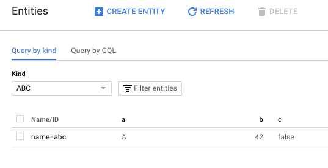

# GCS playground

Study of how Google Cloud Storage can be used from Scala, programmatically.

- writing
- watching for changes
- extracting the history of a key
- access rights; can we restrict access by bucket?

## Requirements

- `sbt`

### Setting up your Google Cloud Datastore

Note: We're expecting some knowledge on handling the [Google Cloud Console](https://console.cloud.google.com/).

1. Create a project, and a service account for it.

  Store the key for the service account under `secrets/`, and export it as (a sample):
  
  `export GOOGLE_APPLICATION_CREDENTIALS=secrets/datastore-playground-040718-581a7301690a.json 
  `

2. Enable Google Cloud Datastore for the project.

  Create in Datastore > Entities (actual values of data don't matter):
  
  
  
  
## Kick the tires  

```
$ sbt "runMain main.MainRead"
...
Fetched 'abc': Entity{key=Key{projectId=datastore-playground-040718, namespace=, path=[PathElement{kind=ABC, id=null, name=abc}]}, properties={a=StringValue{valueType=STRING, excludeFromIndexes=false, meaning=0, value=A}, b=LongValue{valueType=LONG, excludeFromIndexes=false, meaning=0, value=42}, c=BooleanValue{valueType=BOOLEAN, excludeFromIndexes=false, meaning=0, value=false}}}
```

Reading the stuff we had written manually worked.

Let's see writing.

